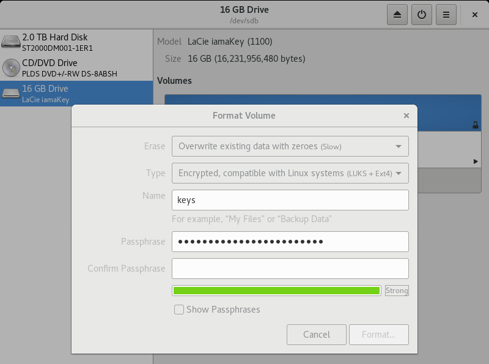

# SSH Keys

Pivots use [encrypted drives][1] to temporarily add their SSH Keys in any machiney they work. Follow the following instructions in order to create an ecrypted drive for your SSH Keys in Linux.

## Setup the drive

1. Reformat the drive using `disks`

    

2. Add your keys to the drive

    * Create new keys

        ```
	ssh-keygen -f /run/media/`whoami`/YOUR_KEY/id_rsa -C "John Doe"
        ```
    * Import existing keys

        ```
	mv /path/to/your/keys /run/media/`whoami`/YOUR_KEY
        ```
3. Copy the load script into your drive

    ```
    cp load /run/media/`whoami`/YOUR_KEY
    ```

## Using the drive


[1]: http://tammersaleh.com/posts/building-an-encrypted-usb-drive-for-your-ssh-keys-in-os-x/
